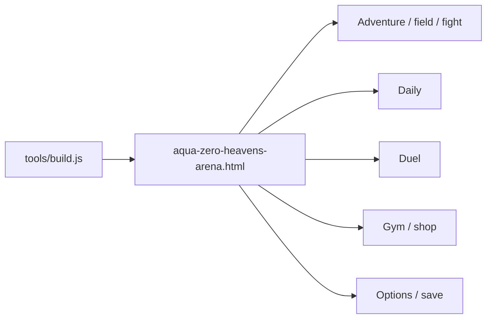

# Aqua Zero Heavens Arena — architecture

One self-contained HTML page, built from source modules. Offline-first.
Supabase auth and cloud saves, the TON wallet path and P2P WebRTC are
**shelved**: the code and its suites stay, none of them is on the default
path, and each is inert until its build env says otherwise (see README and
ADR 0005). No runtime npm dependencies in the page.

## Building

```bash
node tools/build.js                     # bundles src/ into the page
node tests/run-tests.js                 # every suite
node tools/audit-balance.js 4           # roster balance, whole roster vs itself
node tools/gen-docs.js                  # re-measure and rewrite the block below
node tools/tune-roster.js 6 3           # closed-loop rebalance
node tools/build-card-data.js --check aqua-zero-heavens-arena.html
```

Build inputs (`romdata.js`, `bios.txt`, `art.txt`) live in `assets/rom/` -
they are part of the repository, not of any machine.

The page is the deliverable. `src/` is the source; the build concatenates
it into the page in the order listed in `MODULE_ORDER`.

## Production hosting

Static deploy only (Vercel / Netlify / any static host). HTTPS security
headers live in `vercel.json` and `netlify.toml` (HSTS, CSP with
`unsafe-inline` + `data:`/`blob:` for the single-file canvas page, frame
deny, nosniff, no-referrer, Permissions-Policy). Verify with
`node tools/check-production-security.js`.

## The fight

Two fighters commit a technique (or a combination) at the same time, the
turn resolves in initiative order, and four things decide every exchange:

| Layer | What it asks | Where it lives |
|---|---|---|
| **Range** | how far apart are they? | `src/data/matchups.js` |
| **Position** | where in the ring is the action? | `src/battle/position.js` |
| **Stamina** | can they afford to throw it? | `src/battle/order.js` |
| **Conditions** | what is currently wrong with them? | `src/battle/effects.js` |

Range is `LONG → MID → CLINCH → GROUND` and it *travels* — one step at a
time, unless a technique earns more. A committed takedown covers two; a hip
throw has to tie up first. This matters: before it was enforced, takedowns
teleported striking-range to mat and the two middle ranges were a rounding
error in the turn count. The live split is in the generated table under
"Balance is measured" - if MID and CLINCH collapse again, that table says so
before a player has to feel it.

Position is `CENTRE → ROPES → CORNER`, driven by a pressure meter. Cornering
is earned over 2-3 turns of landed work, escapable by spending air, and worth
roughly a 1.3x swing — a win condition, never the win. The meter is on
screen, and the ring is a target: everyone knows the four ringcraft
techniques (`ring_cut` shoves, `ring_circle` is the escape roll,
`ring_barrage` and `ring_reversal` only exist while someone is trapped —
`tech.pos` gates them, `posOk()` in `src/battle/intent.js` enforces it).

**The tell** (`src/battle/intent.js`): the CPU commits before you choose,
and that commitment now shows — class and direction for free, on every
turn. The paid READ still buys the exact technique, so focus stays a
currency. Menu rows answer the tell (`intentHint`), forecast initiative
(`forecastFirst`), and show resolver-true expected damage, not dossier
power.

## The run

```
field → fight → DRAFT a technique → ... → stage clear → BENEFIT → GYM → next stage
```

Three separate decisions, three different currencies:

- **Draft** (`src/progress/draft.js`) — after a won fight, one of three
  techniques from *any* discipline, permanently, for this run. Offers are
  capped by a per-stage power budget so a stage-1 pick can never be
  run-winning.
- **Benefits** (`src/data/benefits.js`) — stacking camp modifiers, one
  of three per stage clear — plus the **EDGE** benefits that each break one
  stated rule (a fourth chain link, a free opener, free escapes, glass
  cannon, doubled purses). EDGEs never appear at camp; they are shop
  contraband priced at ~2 stages of income.
- **The gym** (`src/modes/shop.js`) — fights pay a purse; the shop sells
  techniques, conditioning, corner consumables and heals. The trainer's
  wall adds **subtraction and depth**: CUT retires a technique for the run
  (`run.retired`, floor of 12, fundamentals exempt), DRILL sharpens one
  (+15% power, +5 acc per tier, 2 tiers, `run.drilled`).
- **The nemesis** — lose a fight and the run writes the name down. He is
  flagged on the brief, slightly up at the bell, and beating him pays a
  revenge purse and clears the slate.
- **The corner bag** — corner items are USABLE mid-fight: a fifth row on
  the command menu opens the bag, using an item takes your turn as
  `corner_work` (you cover up while the corner works), and each item's
  declarative `fx` block is applied by `applyCornerFx()`. Smelling salts
  bank a priority boost for the NEXT turn; fresh wraps sharpen exactly
  three strikes; the corner read carries `readShown` across turns.

The fight menu is built from `side.techs` — the live list — so drafted
picks appear, cuts disappear, and the whole loop is visible in-hand.
Every menu, card and shop row is also a pointer target: hover moves the
same cursor the arrows move, click is hover plus A, the wheel scrolls.

Nothing is lost on a defeat: **mastery** (`src/progress/mastery.js`) is
earned every fight, win or lose, per fighter, permanently.

## Balance is measured, not asserted

`tools/audit-balance.js` plays the entire roster against itself using the
real battle model and reports the roster spread, fight length, technique
usage, category mix and range distribution. `tools/tune-roster.js` closes
the loop: it measures, corrects each fighter toward parity, rebuilds and
re-measures until the spread is within tolerance.

`node tools/audit-balance.js 4 --competitive` adds a same-tier finish-rate
report (overall gap at most 6), so mismatch-heavy random pools do not
distort KO/decision calibration.

The corrections live in `src/data/roster-tune.js`, generated and readable,
folded in by `traitsOf()`. The dossiers themselves stay honest - a fighter's
listed attributes remain what the source says, and the balance thumb sits
beside them where it can be argued with.

Everything between the markers below is written by `node tools/gen-docs.js`,
which runs the audit and splices its output in. No figure in it is typed by a
human, and this document once paid for that: it claimed a tight roster while
the audit was printing BROKEN. `node tools/gen-docs.js --check` now fails CI
when the committed block stops matching a fresh run, so a combat change that
moves the roster cannot land with this page still describing the old one.
The same measurements in machine-readable form are in
`docs/balance-report.json`, with the timestamp and commit they came from.

Read the block as one deterministic sweep, not a law. Every fight is seeded
from (fighterA, fighterB, rep), so a given build always prints the same
figures and a figure that moved means the build moved. Turning them into
pass/fail thresholds is a separate job: `tools/check-balance-gate.js` holds
the gates, and the targets they ratchet toward are in
`docs/IMPLEMENTATION_PLAN.md`.

<!-- BEGIN GENERATED BALANCE -->
<!-- Written by `node tools/gen-docs.js`. Do not edit between the markers:
     the next run overwrites it and `node tools/gen-docs.js --check` fails CI. -->

Measured by `node tools/audit-balance.js 4` - 2,400 fights, whole roster against itself, AI on both sides at level 9 with no benefits.
The timestamp and the commit these numbers came from are in `docs/balance-report.json`.

| Metric | Measured |
|---|---|
| Roster win rate | 62.5% (Randall Stevens) down to 47.9% (Derek Nichols), a 14.6-point gap across 25 fighters |
| Audit's own verdict | TIGHT - the roster is competitive |
| Fighters sharing a printed extreme | 2 (1 at the top rate, 2 at the bottom) |
| Discipline win rate | 58.3% (Kenpo Karate) down to 50.0% (Submission Grappling), a 8.3-point gap across 19 disciplines |
| Share of turns by range | LONG 25.2% / MID 26.4% / CLINCH 18.0% / GROUND 30.5% |
| How fights end | submission 33.4% / strike 41.5% |
| Fight length | 15.4 turns on average, 0.0% hit the 60-turn cap |
| Techniques the AI ever throws | 264 of 427 (61.8% of the dex) |
<!-- END GENERATED BALANCE -->

## The presentation layer

The fight was already deep; what it lacked was ceremony. Five modules supply
it, and they follow anim.js's rule without exception — **they own intent, the
renderer owns pixels**. Not one of them touches a canvas, so every beat,
envelope and cue is asserted in a sandbox with no audio and no DOM.

| Module | Answers | Owns |
|---|---|---|
| `ui/music.js` | what is playing | tracks, the tick sequencer, the bell, crowd envelopes |
| `ui/entrance.js` | who is walking out | the walkout timeline, nameplate reveal, latched cues |
| `ui/matchup.js` | who are these two | the tale of the tape, the lean, the storyline |
| `ui/results.js` | what just happened | method of victory, the nine stat rows, the grade |
| `modes/attract.js` | is anyone watching | the idle clock, the pairing, the demo's hands |

Three rules the layer runs on, each of which was a bug before it was a rule:

1. **Cues latch, and latching happens in `step()` only.** `mainLoop` runs up
   to eight `step()`s per drawn frame, so a cue gated on `t === n` misfires on
   a slow frame and a cue latched in `render()` is tied to the refresh rate.
2. **A spent stinger stays spent.** The scene picks a track every frame;
   `musicSwitch` refuses to restart a `once` track, which is the only reason
   the victory fanfare ends. Never reintroduce a hardcoded list of stinger
   names — the next one added would be forgotten.
3. **The demo never reaches `endDuel`.** `attractShouldExit` is checked
   before the duel branch, so a fight nobody was playing cannot write mastery,
   records or the W/L table into a save.

The tale of the tape is a duel **phase** (`D.TAPE`), not a scene, because the
navigation tests press A on SELECT and assert `DUEL` on the next line. Adventure skips it
— `rBrief` is the same card by another name.

## Layout

```
src/data/        techniques, disciplines, benefits, challenges,
                 archetypes, stories, matchups, roster-tune
src/battle/      resolve, order, effects, position, sequence, intent, ai
src/progress/    growth, draft, mastery, save-backup, ranking/
src/modes/       daily, shop, attract
src/ui/          anim, music, matchup, entrance, results
assets/rom/      romdata, bios, art - the build's inputs
tools/           build-card-data, import-techniques, import-portrait,
                 embed-logo, embed-arena, audit-balance, tune-roster,
                 check-balance-gate, gen-docs
tests/           one suite per system, all listed in run-tests.js's SUITES
```

## Rules that are not negotiable

1. **The card data is sacred.** `DECKS`, `ORDER` and `BOSS` are extracted
   from `fight-data.ws` and must stay byte-identical. `--check` proves it.
2. **The roster is human.** Every fighter is a human competitor.
3. **Everyone is playable** from a fresh save. `SAVE.unlocked` means
   "mastered", not "selectable".
4. **ASCII only** in `src/` — the build escapes non-ASCII.
5. **Modules are plain scripts.** No imports, no exports; they are
   concatenated. Watch for name collisions — `kindOf` and `S` have both
   bitten already.
6. **Re-measure after touching combat.** `TECH_DMG_SCALE`, range falloff and
   the escape curve all move the whole game.
7. **Presentation modules never draw.** No canvas, no `cx`, no DOM, no
   AudioContext below `src/ui/` and `src/modes/`. This is what keeps the
   whole layer testable without a browser.
8. **Address UI rows by id, not by index.** `optionRows()` is read by both the
   renderer and the key handler; the options screen used to dispatch on
   `G.optSel===4`, so inserting one row silently re-pointed ERASE SAVE at its
   neighbour.

## Diagram



Architecture decisions: [docs/adr/](docs/adr/).
